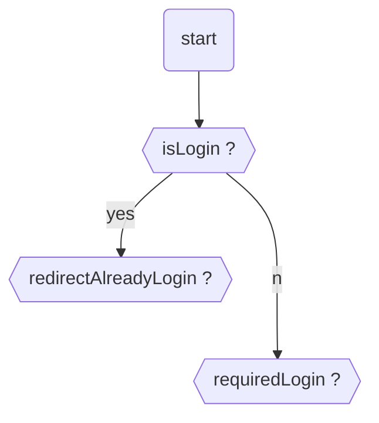
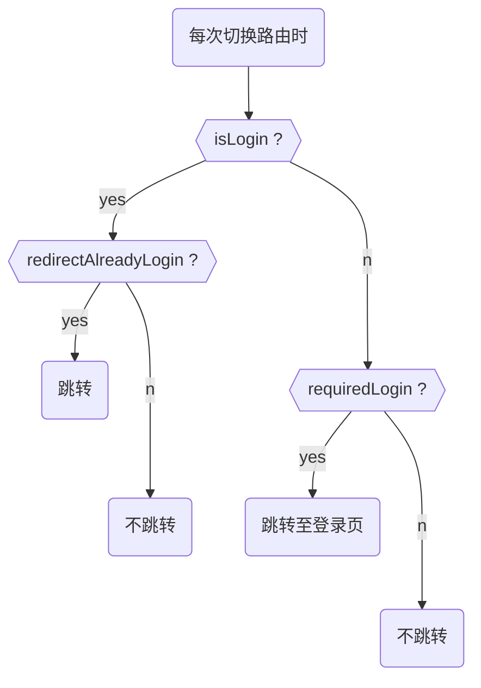
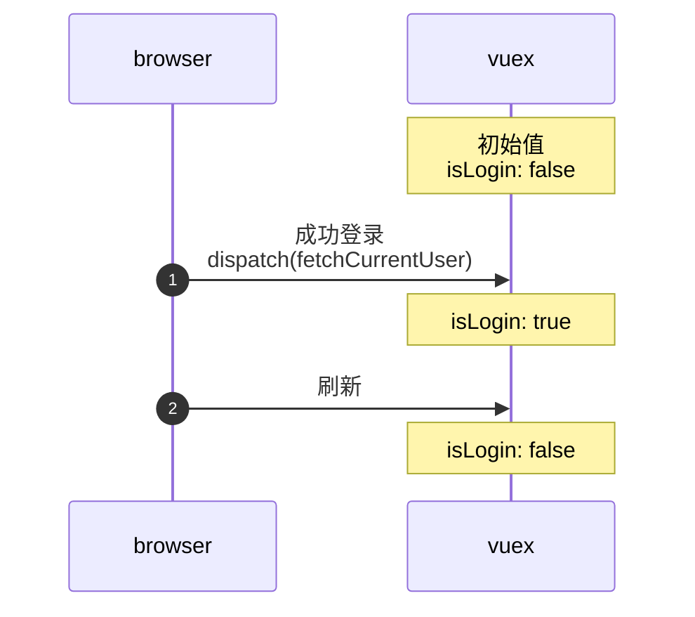
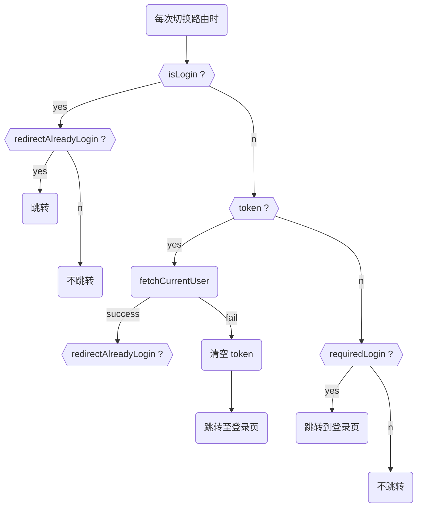
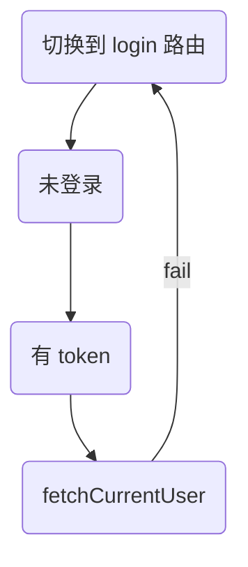

# 9-6 改进路由验证系统
#NOTE
## 之前的路由系统
- 之前的路由系统逻辑比较简单。借助 axios 提供的 beforeEach 钩子函数，在每次进入页面时，对 `isLogin`、 `redirectAlreadyLogin`、`requiredLogin` 进行验证，决定加载目标页面还是跳转至其他页面
  - `isLogin`: 用户登录状态
  - `redirectAlreadyLogin`: 对已经登录的用户，是否需要跳转至其他页面
  - `requiredLogin`: 是否需要登录
- 使用 `vue-router` 创建 `router` 时，可以将需要验证的值卸载对应的路由(route) 的 `meta` 属性中
```javascript
  routes: [
    {
      path: "/login",
      name: "login",
      component: Login,
      meta: { redirectAlreadyLogin: true }
    },
    {
      path: "/create",
      name: "create",
      component: CreatePost,
      meta: { requiredLogin: true }
    }
  ]
```
- 路由系统包含了两层逻辑，验证逻辑和跳转逻辑
- 验证逻辑如下

- 跳转逻辑如下

- 这里值得分析的是刷新 `创建文章页(createPost)` 时的跳转逻辑，也是路由需要改进的地方。`isLogin` 保存在 vuex 中，每次刷新页面都会将其重置为 `false`。也就是说一旦刷新创建文章页，就会重新跳转到登录页

## 现在的路由系统
- 现在的目的是确保登录后刷新创建文章页时，页面不会跳转至登录页，有两种方案，都是为了确保进入页面前，`isLogin` 为 true：
  - 登录后将 `isLogin` 保存在浏览器存储中
  - 在进入页面前，再次 `dispatch(fetchCurrentUser)`
  - [ ] 保存用户登录状态有哪些方案？这些方案的适用场景是？有何优劣？
- 当前使用的是方案二
- 跳转逻辑如下

- 处理 `token` 被篡改的情况。当 token 被篡改时，如果不清除 token，会陷入以下死循环：

## 拓展
- [ ] [Authentication best practices for Vue - Sqreen Blog](https://blog.sqreen.com/authentication-best-practices-vue/)
- [ ] [前端路由的前生今世及实现原理 · Issue #2 · hwen/blogsome](https://github.com/hwen/blogSome/issues/2)