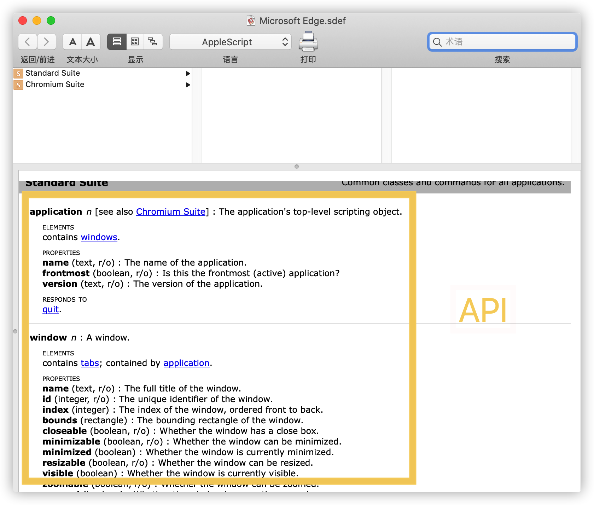

# browser-control
## 简介
- 修改了 [chrome-control](https://github.com/bit2pixel/chrome-control) 
- 相关文章: [How I Navigate Hundreds of Tabs on Chrome with JXA and Alfred | by Renan Cakirerk | Medium](https://medium.com/@bit2pixel/how-i-navigate-hundreds-of-tabs-on-chrome-with-jxa-and-alfred-9bbf971af02b)
- 脚本位置 `~/Application/myScript`
- JAX+Alfred workflow 文件位于 `./example` 
- 注意: 首次执行时, 需要使用 `chmod +x ./alfred-browser.js` 提供脚本运行权限
## 命令
- `tabs`: Lists all tabs
- `close url <keywords>`: Close tabs with URLs matching these keywords
- `close title <keywords>`: Close tabs with titles matching these keywords
- `dedup`: Close duplicate tabs
##  Alfred workflow 是如何工作的?

- 虽然叫 Alfred workflow, 但并不是所有工作都是 Alfred 完成的, 主要逻辑在 JAX 脚本中完成. JAX 调用 apple 提供的应用 API 获取数据并进行处理. 应用 API 可以通过 `脚本编辑器>文件>字典>app` 查询

## 改进方向
- [sindresorhus/alfy: Create Alfred workflows with ease](https://github.com/sindresorhus/alfy)
- #IMPR: 现阶段需要两步配置才能让 Alfre workflow 生效. 
  - 1. 设置 JAX 脚本 2. 安装 `.workflow` 文件. 该文件中使用 sh 脚本 调用 JAX.
  - 能不能让 sh 脚本从远端(比如 gist) 获取 JAX 脚本, 并缓存到本地, 进而省去本地配置这一步呢?
  