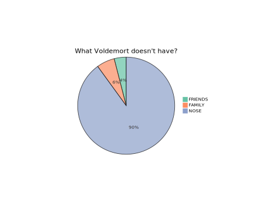

<style>
img{
  width: 50%;
  margin-left: 50%;
  transform: translateX(-50%);
  transition: 0.5s ease
}
img:hover{
  transform: scale(2) translateX(-25%) translateY(-25%);
  background: white;
  border-radius: 2px
}
</style>
- 代码
```javascript
<style>
img{
  width: 50%;
  margin-left: 50%;
  transform: translateX(-50%);
  transition: 0.5s ease
}
img:hover{
  transform: scale(2) translateX(-25%) translateY(-25%);
  background: white;
  border-radius: 2px
}
```
- svg 图片

- 普通图片

- #BUG: 当图片位于页面顶部时, 放大后的图像会超出视图之外
