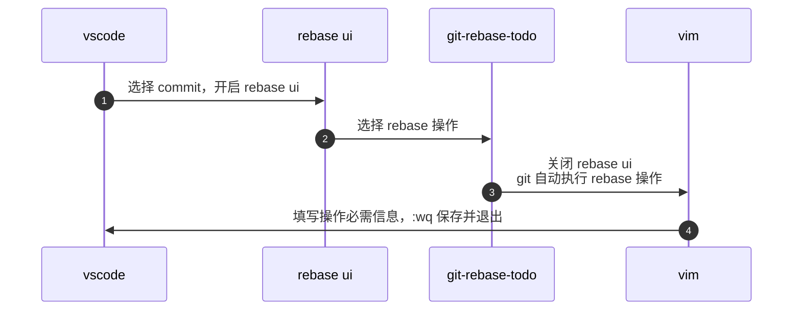

### 前言
- 为什么迁移到 foam ？
  - obsidian 目前功能不完善，而且很卡 
  - foam 依托于 vscode，相较于 obsidian 有以下优势
    - 流畅
    - 主要面向开发者，插件多、性能较好、功能完善
    - 代码高亮
    - 编辑体验优于 obsidain
  - 迁移后能够在 vscode 中完成大部分操作
- 我用 foam 做什么？
  - 记录我的 trash thoughts 和项目思路

### 初始化
- 仓库地址：[HenryC-3/FoamC-3: HenryC-3's foam template](https://github.com/HenryC-3/FoamC-3)

### 版本管理
这部分的内容结合具体情境更好理解
- 刚刚 commit 完，你又发现了一个拼写错误，该怎么办？
  - gitlens undo commit
  -  
  - git commit --amend: 添加当前已经 stage 的修改到最近一次 commit。指令执行完毕后，终端会跳出 vim 编辑页，提示输入 commit message，输入 `:wq` 退出即可
- 有多个零碎的 commit，想把它们合并成一个，该怎么办？
  - git rebase squash: 将当前 commit 与前一个 commit 合并 
  - 注意：
    - 每次 rebase 完成，终端都会跳出 vim 编辑窗口
    - 不要在 rebase 完成之前 commit，否则 rebase 结束后，在 rebase 期间的 commit 都会被清空
    - rebase 过程中，我们操作的是一组 commit。右键点击某个 commit 开启 rebase ui 后，该 commit 并不包含在可操作的 commit 中。例如下方图中，点击“第一次提交”开启 ui，能够操作的只有“第二次提交”和“第三次提交”
    - 
## 流程
### 任务管理流程

### rebase 流程
在 vscode 中使用 gitlens 提供的 rebase interactive UI(简称 rebase ui) 进行 rebase。开始 rebase 时，首先要在 git-rebase-todo 中填写 rebase 操作，rebase UI 是可视化“填写”过程的工具。
- rebase 操作，在 rebase UI 中点击“switch to text”即可看到 rebase 操作说明，我常用的有：
  - reword：修改 commit 的信息
  - squash/fixup：合并当前 commit 到前一个 commit
- rebase 流程

## Q&A
- Q: foam 与 项目代码之间的关系是？
- A: foam 中的内容本质上与 git commit message(以下简称 msg)无异，是与代码绑定的一段文本。该文本用于
  - 辅助说明代码逻辑，文字描述加流程图
  - 快捷访问编码过程中相关资料，框架文档、api、规范、stackoverflow……
  - 跟踪执行进度，该处是否存在问题？未来是否会优化？
  - 头脑风暴，记录编码前、中、后期产生的各种想法foam 与 项目代码之间的关系是？
  - foam 增强了 msg，但由于软件因素，无法替代 msg