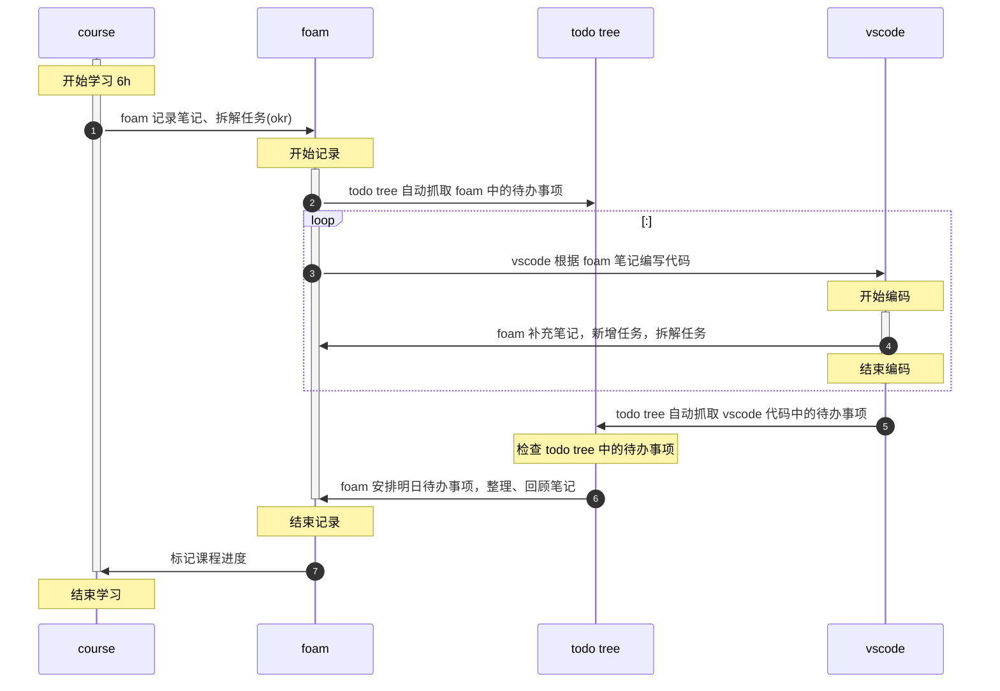
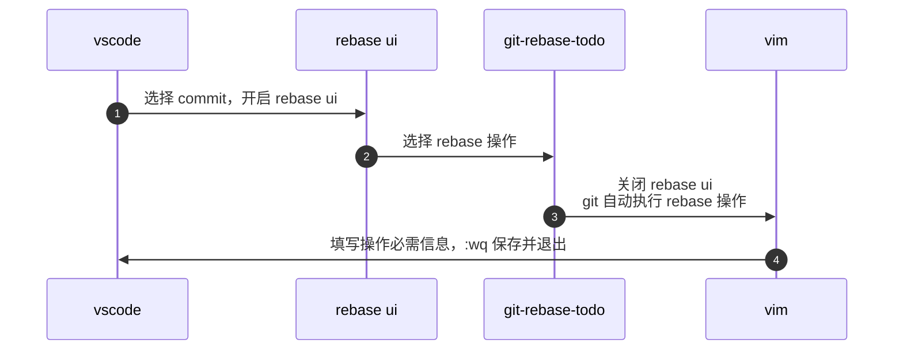

### 前言
- 为什么迁移到 foam ？
  - obsidian 目前功能不完善，而且很卡 
  - foam 依托于 vscode，相较于 obsidian 有以下优势
    - 流畅
    - 主要面向开发者，插件多、性能较好、功能完善
    - 代码高亮
    - 编辑体验优于 obsidain
  - 迁移后能够在 vscode 中完成大部分操作

### 初始化
- 仓库地址：[HenryC-3/FoamC-3: HenryC-3's foam template](https://github.com/HenryC-3/FoamC-3)
### 快捷键
> 参考 [VSCode 教程丨阿西河](https://www.axihe.com/tools/vscode/home.html)
主力机为 Hackintosh，原机键盘为 windows 布局，对左下键盘布局进行了更改，由`crtl | fn | windows | alt` 更改为 `cmd | fn | crtl | alt`
- 预览：cmd+k,v 或 cmd+shift+v
- 视图(移动时，鼠标必须聚焦某一窗口上)
  - 切换 workspace(在多个 vscode 编辑器之间切换)：crtl+w
  - 切换左右编辑器：cmd+shift+[ | ]
  - 切换到之前|后的编辑器：cmd+alt+left | right
  - 切换文件：cmd+p
  - 折叠节点内容：cmd+k, cmd+1/2/3/4
  - 展开节点内容：cmd+k，cmd+j
- 编辑
  - 左右按单个字符移动光标：alt+left | right 
  - 同时编辑多处：cmd+alt+方向键
  - 移动到括号末尾：cmd+shift+\
  - 跳出括号、引号：对应符号右侧
  - 上下移动行：alt+top | down
  - 换行：shift+cmd+enter
  - 图片粘贴：ctrl+alt+v
- 查找
  - 查找光标所在单词：cmd+e

### 版本管理
这部分的内容结合具体情境更好理解
- 刚刚 commit 完，你又发现了一个拼写错误，该怎么办？
  - gitlens undo commit
  -  
  - git commit --amend: 添加当前已经 stage 的修改到最近一次 commit。指令执行完毕后，终端会跳出 vim 编辑页，提示输入 commit message，输入 `:wq` 退出即可
- 有多个零碎的 commit，想把它们合并成一个，该怎么办？
  - git rebase squash: 将当前 commit 与前一个 commit 合并 
  - 注意：
    - 每次 rebase 完成，终端都会跳出 vim 编辑窗口
    - 不要在 rebase 完成之前 commit，否则 rebase 结束后，在 rebase 期间的 commit 都会被清空
    - rebase 过程中，我们操作的是一组 commit。右键点击某个 commit 开启 rebase ui 后，该 commit 并不包含在可操作的 commit 中。例如下方图中，点击“第一次提交”开启 ui，能够操作的只有“第二次提交”和“第三次提交”
    - 
## 流程
### 任务管理流程

### rebase 流程
在 vscode 中使用 gitlens 提供的 rebase interactive UI(简称 rebase ui) 进行 rebase。开始 rebase 时，首先要在 git-rebase-todo 中填写 rebase 操作，rebase UI 是可视化“填写”过程的工具。
- rebase 操作，在 rebase UI 中点击“switch to text”即可看到 rebase 操作说明，我常用的有：
  - reword：修改 commit 的信息
  - squash/fixup：合并当前 commit 到前一个 commit
- rebase 流程

## Q&A
**Q: foam 与 项目代码之间的关系是？**

A: foam 中的内容本质上与 git commit message(以下简称 msg)无异，是与代码绑定的一段文本。该文本用于
- 辅助说明代码逻辑，文字描述加流程图
- 快捷访问编码过程中相关资料，框架文档、api、规范、stackoverflow……
- 跟踪执行进度，该处是否存在问题？未来是否会优化？
- 头脑风暴，记录编码前、中、后期产生的各种想法foam 与 项目代码之间的关系是？

foam 增强了 msg，但由于软件因素，无法替代 msg，

### 其他
- 绘制流程图前的构思工作
  - 确定起止时间
  - 确定参与对象

### 待办
- #IMPR
  -  [ ] vscode 快速切换到 chrome or Edge [How I Navigate Hundreds of Tabs on Chrome with JXA and Alfred | by Renan Cakirerk | Medium](https://medium.com/@bit2pixel/how-i-navigate-hundreds-of-tabs-on-chrome-with-jxa-and-alfred-9bbf971af02b)
- #BUG
  - [ ] 发布到 gitpage 后，所有包含`|` 的内容都会被渲染为表格
  - [ ] 不支持 mermaid