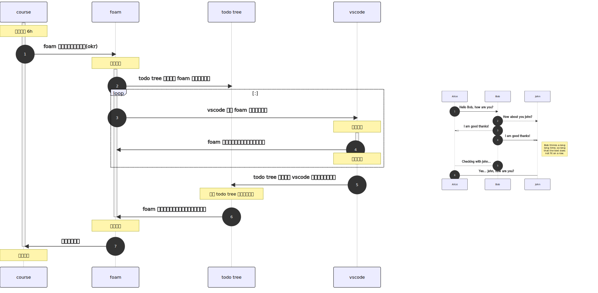
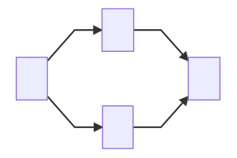

- 插件 repo： [nopeslide/drawio_mermaid_plugin: Mermaid plugin for drawio desktop](https://github.com/nopeslide/drawio_mermaid_plugin)
- 左侧为调整后的时序图，在 drawio 中显示规格为：1260x830，右侧是 vscode drawio mermaid plugin 默认提供的时序图，非常小，需要手动拉大

- 图片在 drawio 中显示规格为：300x200, vscode drawio mermaid plugin 提供的图形大小并不统一，下图中提供的流程图就比默认提供的时序图大很多

- #IMRP: 修改[sequenceDiagram 图形参数](https://github.com/nopeslide/drawio_mermaid_plugin/blob/master/drawio_desktop/src/shapes/shapeMermaid.js)，确保比例大小一致 