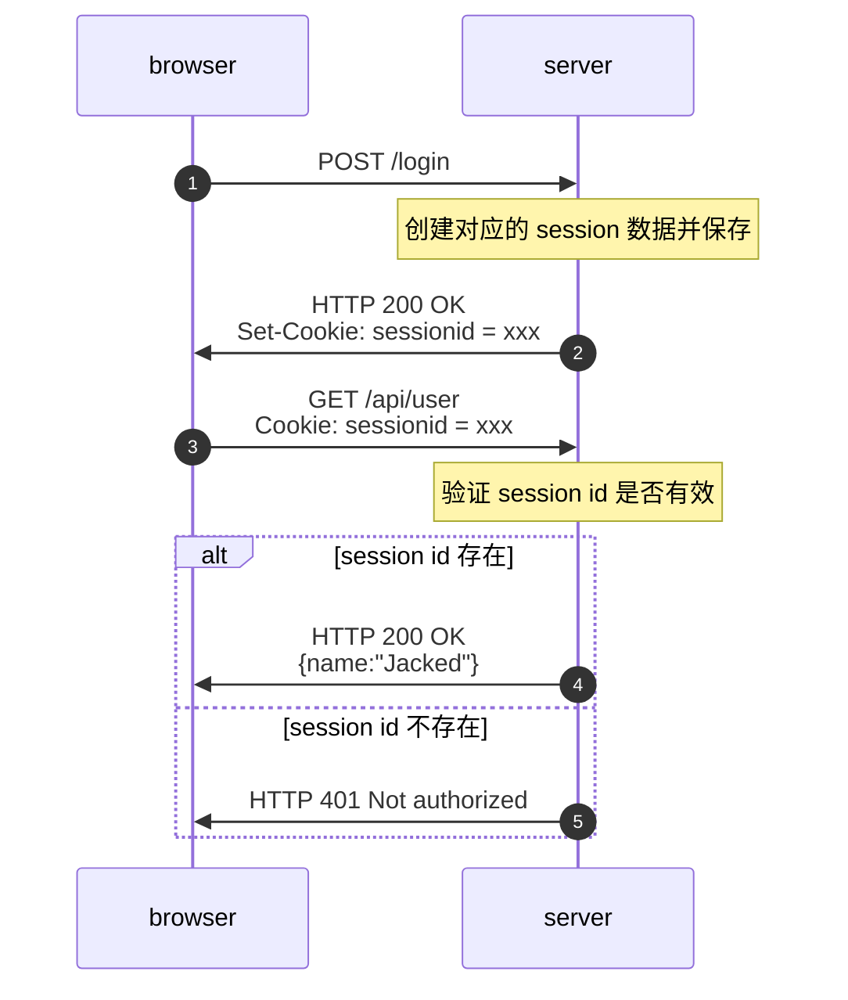
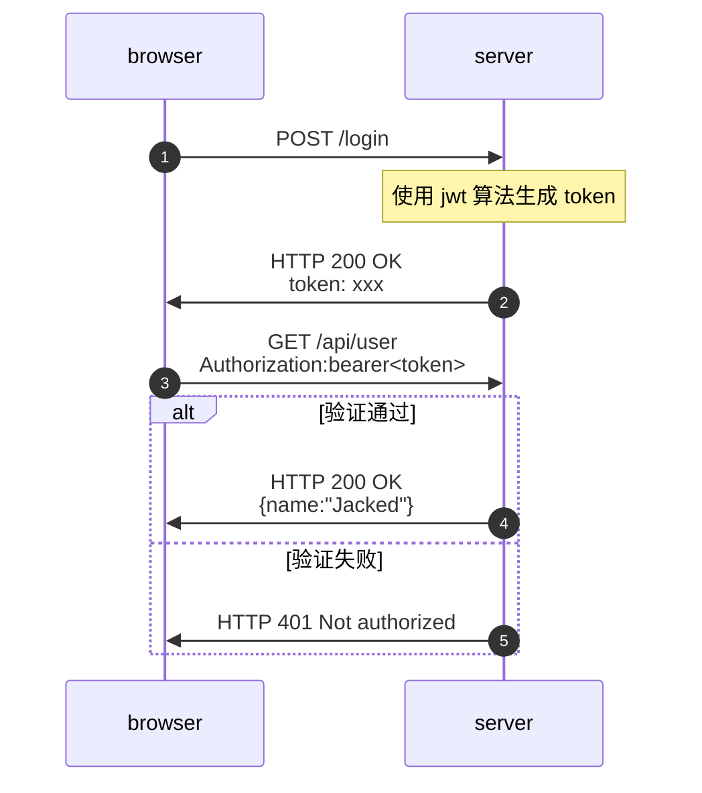
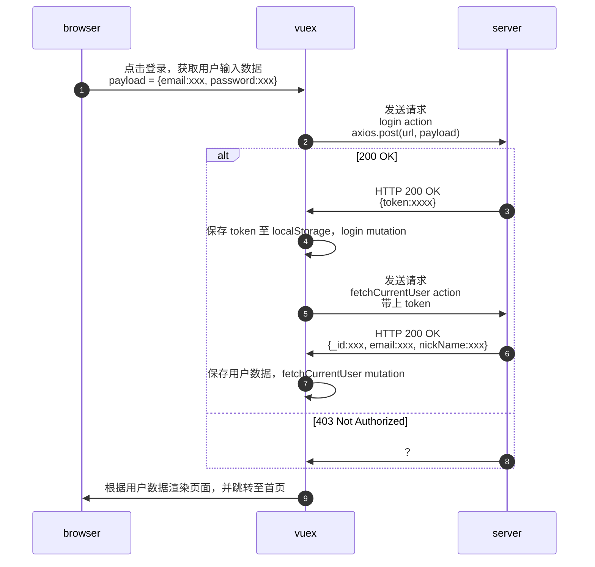

### 第8章 通行凭证 - 权限管理
- 8-1 登录第一部分 获取token
- 8-2 jwt 的运行机制
- 8-3 登录第二部分  axios 设置通用 head
- 8-4 登录第三部分 持久化登录状态
- 8-5 通用错误处理
<details style='margin-left:23px'>
<summary>8-6 创建 Message 组件</summary>

  - 组件位置：自由创建
  - 组件参数：
    - props
      - error 
      - type
    - emit
      - close-message，点击关闭按钮触发
  - 组件样式：
    - bootstrap alert
    - 页面顶层上方
  - 组件行为：
    - 显隐
      - 登录操作完成后在页面上方显示成功或失败信息
      - ~~组件持续一段时间后消失~~
      - 点击关闭按钮，组件消失
</details>

- 8-7 Message 组件改进为函数调用形式
  - 变化
    - 显隐
      - 原来：默认关闭，监听数据变化，数据变化时显示组件，点击关闭按钮隐藏
      - 现在：默认关闭，页面异步获取完数据后显示，一定时间后自动销毁，也可以提前关闭
  - 好处
    - 之前的组件
      - 全局开启的，也就是说每进入一个页面，一旦该页面需要发送请求，导致了 Message 组件中监听数据变化，Message 组件就会显示。现在 Message 组件只在调用了 createMessage 的页面中出现
      - 无法自定义显示信息，只能根据后端返回数据显示信息
      - 无法控制显示的时机
      - 无法自动销毁
    - 总而言之，现在的提供的控制选项更多，更加灵活
  - 伪代码
  - ```javascript
      // 创建 message 组件，样式为“success”，显示登录成功，2000 后消失
      createMessage("登录成功","success",2000)
      ``` 
- 8-8 作业：注册页面的编写
### 笔记
- 权限认证，cookie-session 传统验证方案 

- 权限认证，jwt 验证方案

- axios 设置通用 header
  - 设置 header 的过程并不难，但是 axios 在返回的数据外额外包裹了一层对象，导致传参错误
  ```javascript
  // 后端接口返回的数据
  {data: {"token": "xxx"}}
  // axios 包裹后
  {data:{"data": {"token": "xxx"}}}
  ```
  - 调试过程中又顺便复习了一遍宏任务、微任务的执行顺序，启动项目，访问 http://localhost:8080/login，使用 henry@qq.com 密码 123456 登录，打开控制台，即可跳转到调试界面
- vuex 发送多个 action
  - 文档：[Action | Vuex](https://vuex.vuejs.org/zh/guide/actions.html#%E5%9C%A8%E7%BB%84%E4%BB%B6%E4%B8%AD%E5%88%86%E5%8F%91-action)
  - 场景：用户登录后，需要获取用户数据
- 如何以函数形式调用组件？这样有什么好处？
### 待办
- [x] 获取 token，登录测试账号 henry@qq.com 密码 123456
- [x] 使用 token 获取当前用户信息
  - [x] axios 设置通用 header
  - [x] vuex 发送多个 action
- [x] 持久化登录状态
- [x] 登录失败后的处理逻辑(流程 8)
  - 不跳转页面
  - 页面上显示错误提示
- [x] message 组件
### 登录跳转流程
