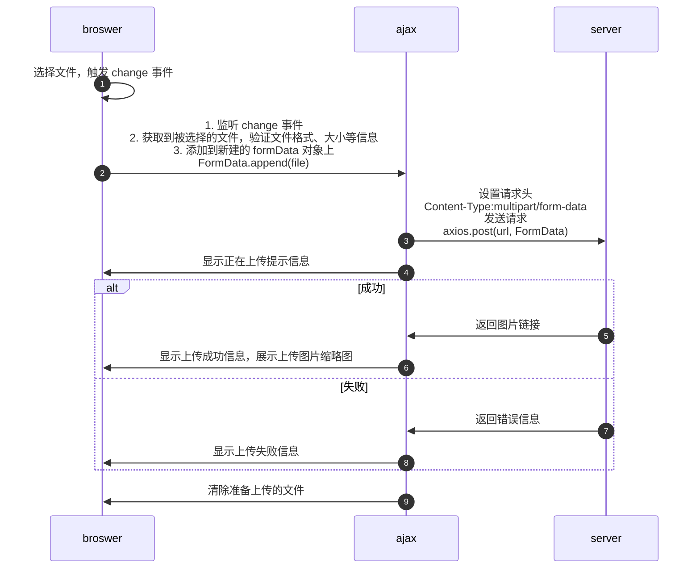
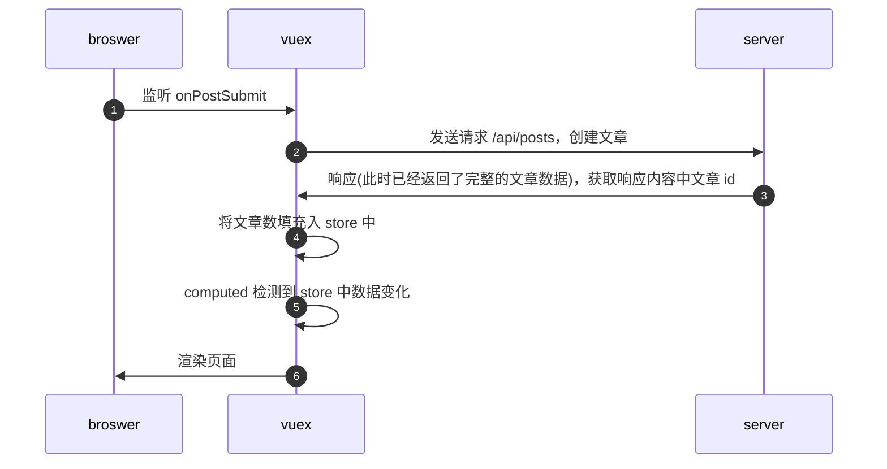

<style>
img{
    width: 50%;
    padding-left: 20%;
}
</style>

### 第 9 章 道高一尺 - 上传组件

- 9-1 上传组件需求分析
- 9-2 上传文件的两种实现方式
- 9-3
- 9-4 Uploader 组件第二部分
- 9-5 Uploader 组件第三部分：自定义模版
- [[9-6 改进路由验证系统]]
- 9-7 创建文章页面实现 Uploader 自定义样式
- 9-8 大功告成 创建文章最后流程
- 9-9 作业 完成文章详情页

### 上传原理

- 参考资料
  - [Using XMLHttpRequest 发送表单、上传文件 - Web APIs | MDN](https://developer.mozilla.org/en-US/docs/Web/API/XMLHttpRequest/Using_XMLHttpRequest#submitting_forms_and_uploading_files)
  - 何时使用 [html - What does enctype='multipart/form-data' mean? - Stack Overflow](https://stackoverflow.com/a/28380690/10915537)
    - `multipart/form-data`: 上传文件时使用
    - `application/x-www-form-urlencoded`: 除上传文件外使用
    - `text/plain`: 基本不使用
    - 切换到 example 文件夹下，命令行中输入 `nc -kdl localhost 8000` 搭建 echo server，查看三者的请求体。只有 `multipart/form-data` 成功发送了文件，其他只发送了文件名
      - `multipart/form-data`
        - 
      - `application/x-www-form-urlencoded`
        - ```text
          text1=text+default&text2=a%CF%89b&file1=a.html&file2=a.txt&file3=
          ```
      - `text/plain`
        - ```text
          text1=text default
          text2=aωb
          file1=a.html
          file2=a.txt
          file3=
          ```
  - 注意
    - `<form action="http://localhost:8000" method="post" enctype="text/plain">`，表单中的 enctype 相当于请求头中的 content-type
  - 关键 API
    - [FormData.append() - Web APIs | MDN](https://developer.mozilla.org/en-US/docs/Web/API/FormData/append)

### ajax 上传文件流程

- `change` 事件在 input type 不同时，触发的时机不同，当 type = file 时，`change` 事件会在选择上传文件时触发，此时可以监听 `change` 事件，并获取该文件



### 创建文章跳转流程



#### 重构 store 中 post 数据结构

为什么要重构？上图第 4 步中需要将数据添加至 post 中，但是 post 的数据结构为：

```javascript
[
  {
    _id: "xxxx1",
    content: "xxxx"
  }
];
```

每次添加文章，都需要利用文章 id 遍历匹配。计划重构为：

```javascript
{
  _id: {
    _id:"xxxx1",
    content: "xxxx"
  }
}
```

重构后，直接 `post.push(新建文章)` 即可

### 心得

- 靠，傻了吧唧的认证搞半天。上传文件时请求体为 formData，需要使用 FormData.append 把认证码加进去

[//begin]: # "Autogenerated link references for markdown compatibility"
[9-6 改进路由验证系统]: 9-6 改进路由验证系统 "9-6 改进路由验证系统"
[//end]: # "Autogenerated link references"
