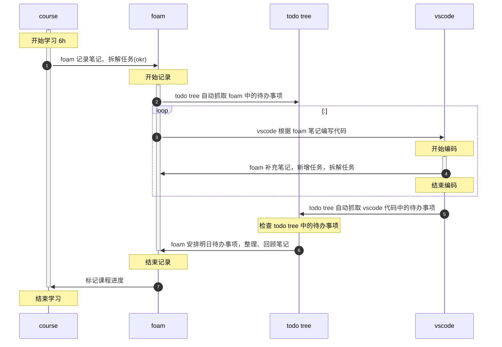

### 前言
- 为什么迁移到 foam ？
  - obsidian 目前功能不完善，而且很卡 
  - foam 依托于 vscode，相较于 obsidian 有以下优势
    - 流畅
    - 主要面向开发者，插件多、性能较好、功能完善
    - 代码高亮
    - 编辑体验优于 obsidain
  - 迁移后能够在 vscode 中完成大部分操作

### 初始化
- 仓库地址：[HenryC-3/FoamC-3: HenryC-3's foam template](https://github.com/HenryC-3/FoamC-3)
### 快捷键

- 预览：cmd+k,v 或 cmd+shift+v
- 视图(移动时，鼠标必须聚焦某一窗口上)
  - 切换左右编辑器：cmd+shift+[ | ]
  - 切换到之前|后的编辑器：cmd+alt+left | right
  - 切换文件：cmd+p
- 编辑
  - 左右按单个字符移动光标：alt+left | right 
  - 同时编辑多处：cmd+alt+方向键
  - 移动到括号末尾：cmd+shift+\
  - 跳出括号、引号：对应符号右侧
  - 上下移动行：alt+top | down
  - 换行：shift+cmd+enter
  - 图片粘贴：ctrl+alt+v
- 查找
  - 查找光标所在单词：cmd+e

### 流程 

### Q&A
**Q: foam 与 项目代码之间的关系是？**

A: foam 中的内容本质上与 git commit message(以下简称 msg)无异，是与代码绑定的一段文本。该文本用于
- 辅助说明代码逻辑，文字描述加流程图
- 快捷访问编码过程中相关资料，框架文档、api、规范、stackoverflow……
- 跟踪执行进度，该处是否存在问题？未来是否会优化？
- 头脑风暴，记录编码前、中、后期产生的各种想法foam 与 项目代码之间的关系是？

foam 增强了 msg，但由于软件因素，无法替代 msg，

### 其他
- 绘制流程图前的构思工作
  - 确定起止时间
  - 确定参与对象