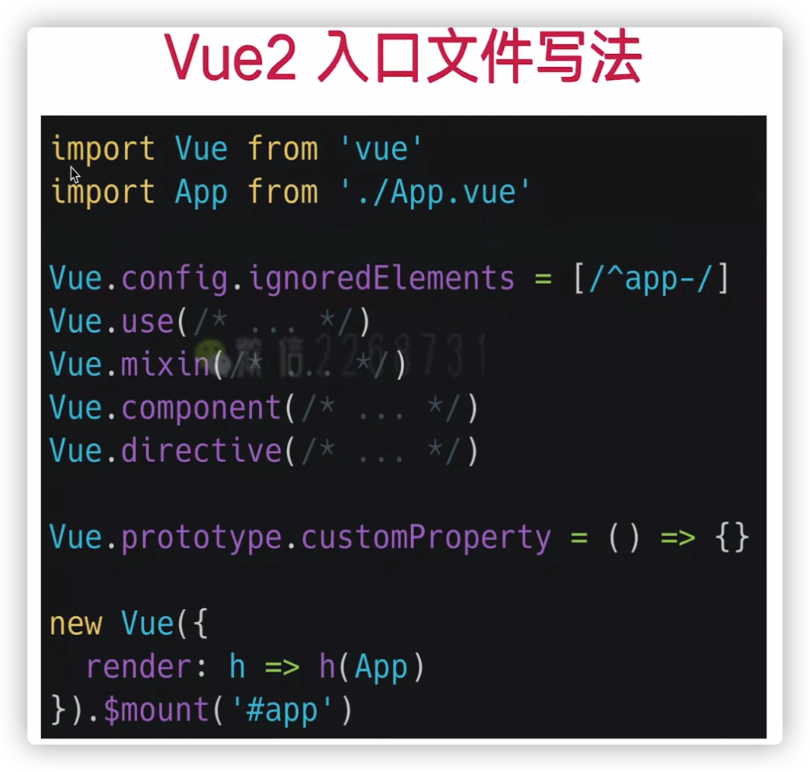

### 第3章 初识 Vue3.0： 新特性详解
- 3-1 vue3 新特性巡礼
- 3-2 为什么会有 vue3
- 3-3 使用 vue-cli 配置 vue3 开发环境
- 3-4 项目文件结构分析和推荐插件安装
- 3-5 vue3 - ref 的妙用
- 3-6 更近一步 - reactive
- 3-7 vue3 响应式对象的新花样
	- 知识点
		- `object.defineProperty`
		- `proxy`
		- 为什么 [[project/Vue3+TS 知乎专栏/source/vue2doc/src/v2/guide/reactivity#检测变化的注意事项 |vue2 中无法检测数组和对象的变化]]？
		- 为什么 vue3 可以
			- 因为 vue3 响应式对象内部依赖了 proxy 
	- 待办
		- [ ] 了解两个 API，对比其差异
		- [ ] 了解 Vue2 如何使用 `object.defineProperty` 实现响应式对象
		- [ ] 了解 Vue3 如何使用 `Proxy` 实现响应式对象
- 3-8 老瓶新酒 - 生命周期
	- 知识点
		- [[../source/vue2doc/src/v2/guide/instance#生命周期图示|vue2 生命周期]]
		- [ ] 在 setup 中使用生命周期函数
		- vue2 vue3 生命周期对照表
		
- 3-9 侦测变化 - watch
	- 知识点
		- 在 setup 中使用 watch
	- 待办
		- [ ] 在 setup 中使用 watch
- 3-10 vue3 模块化妙用- 鼠标追踪器
	- 待办
		- [x] 使用 setup 实现鼠标追踪器
		- [x] 抽离鼠标追踪器逻辑，实现复用
- 3-11 模块化难度上升 - useURLLoader
	- 知识点
		- 自定义 vue hooks 时需要注意些什么？
			- [Vue3造“hooks”轮子前先看看这个](https://juejin.cn/post/6893289942596714503)
- 3-12 模块化结合typescript - 泛型改造
	- 知识点
		- [[refs-api#Refs]]
- 3-13 Typescript 对 vue3 的加持
- 3-14 Teleport - 瞬间移动 第一部分
	- 知识点
		- teleport 是为了解决什么问题？
			- 以常用组件 Dialog 为例，Dialog 作为一个通用组件，可能会被各种组件调用，最终导致 Dialog 组件嵌套层级过深
			
		- 组件嵌套过深会带来什么问题？
			- Dialog 的样式容易被干扰
			- 样式在其他组件中，容易非常混乱
		- teleport 做了什么？
			- teleport 将组件渲染到指定位置，跳出了层级，避免了样式干扰问题，但依旧保留了书写形式上的组件嵌套关系
- 3-15 Teleport - 瞬间移动 第二部分
- 3-16  Suspense - 异步请求好帮手第一部分
- 3-17 Suspense - 异步请求好帮手第二部分
	- 知识点
		-  setup 中使用 `onErrorCaptured` 捕捉错误
- 3-18 全局 API 修改
	- 知识点
		- vue2 中入口文件写法，这种写法会造成什么问题？
			- vue2 修改了全局对象上的一系列属性
			- 单元测试中，全局配置非常容易污染全局环境
			- 在不同 app 中，想要共享一份不同配置的 vue 对象非常困难
		
		- vue3 中
    