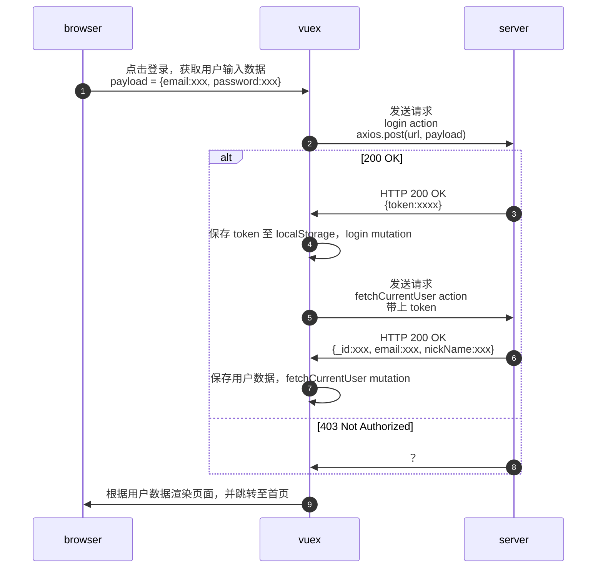

### 第8章 通行凭证 - 权限管理
- 8-1 登录第一部分 获取token
- 8-2 jwt 的运行机制
  - #note
    - 权限认证，cookie-session 传统验证方案 
    ```mermaid
    sequenceDiagram
    participant b as browser
    participant s as server
    autonumber
    b->>s: POST /login
    Note over s:创建对应的 session 数据并保存
    s->>b: HTTP 200 OK<br>Set-Cookie: sessionid = xxx
    b->>s: GET /api/user<br>Cookie: sessionid = xxx
    Note over s:验证 session id 是否有效
    alt session id 存在
      s->>b: HTTP 200 OK<br>{name:"Jacked"}
    else session id 不存在
      s->>b: HTTP 401 Not authorized
    end
    ``` 
    - 权限认证，jwt 验证方案
    ```mermaid
    sequenceDiagram
    participant b as browser
    participant s as server
    autonumber
    b->>s: POST /login
    Note over s:使用 jwt 算法生成 token
    s->>b: HTTP 200 OK<br>token: xxx
    b->>s: GET /api/user<br>Authorization:bearer<token>
    alt 验证通过
      s->>b: HTTP 200 OK<br>{name:"Jacked"}
    else 验证失败
      s->>b: HTTP 401 Not authorized
    end    
    ```
- 8-3 登录第二部分  axios 设置通用 head
  - axios 设置通用 header
    - #note
        - 设置 header 的过程并不难，但是 axios 在返回的数据外额外包裹了一层对象，导致传参错误
        ```javascript
        // 后端接口返回的数据
        {data: {"token": "xxx"}}
        // axios 包裹后
        {data:{"data": {"token": "xxx"}}}
        ```
        - 调试过程中又顺便复习了一遍宏任务、微任务的执行顺序，启动项目，访问 http://localhost:8080/login，使用 henry@qq.com 密码 123456 登录，打开控制台，即可跳转到调试界面
  - vuex 发送多个 action
    - 文档：[Action | Vuex](https://vuex.vuejs.org/zh/guide/actions.html#%E5%9C%A8%E7%BB%84%E4%BB%B6%E4%B8%AD%E5%88%86%E5%8F%91-action)
    - 场景：用户登录后，需要获取用户数据
- 8-4 登录第三部分 持久化登录状态
- 8-5 通用错误处理
- 8-6 创建 Message 组件
- 8-7 Message 组件改进为函数调用形式
- 8-8 作业：注册页面的编写
### 待办
- [x] 获取 token，登录测试账号 henry@qq.com 密码 123456
- [x] 使用 token 获取当前用户信息
  - [x] axios 设置通用 header
  - [x] vuex 发送多个 action
- [x] 持久化登录状态
- [x] 登录失败后的处理逻辑(流程 8)
  - 不跳转页面
  - 页面上显示错误提示
- [ ] message 组件
### 流程

